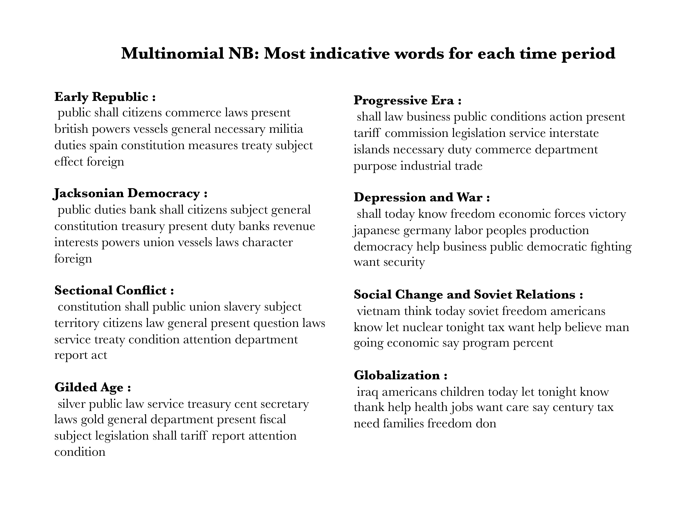
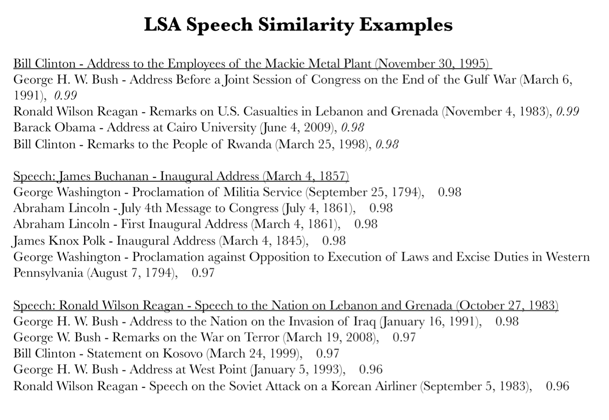
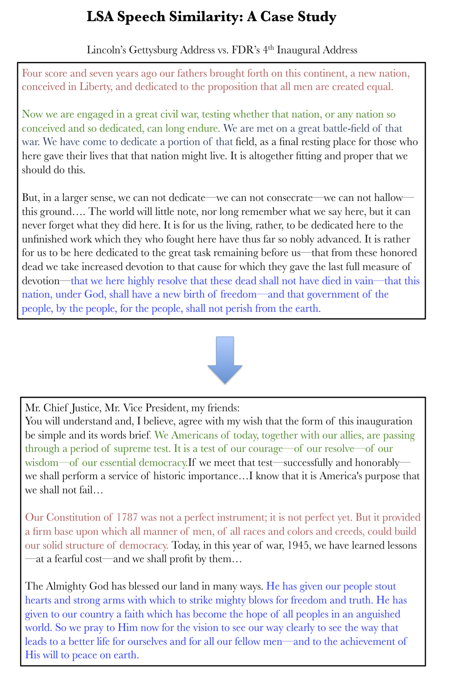

###Motivation:

Political scientists and historians often seek to analyze patterns in political issues, movements, and topics across different points in history. 

I was curious about what insights of this nature statistical learning methods could uncover from a dataset of presidential speeches. I wanted to see if various machine learning approaches could extract the key topics/sentiments facing the United States from these speeches. I also wanted to explore how the content of these speeches changed over time, and possibly find similarities or patterns in topics over time. 

###Collecting/Cleaning the Data:

I used the presidential speeches dataset from the Miller Center at the University of Virginia. It contains the transcripts of 627 speeches given by the presidents, across time. I used the same time periods suggested by the Miller Center:

* Early Republic (1789–1829)
* Jacksonian Democracy(1829–1853)
* Sectional Conflict (1853–1881)
* Gilded Age (1881–1897)
* Progressive Era (1897–1921)
* Depression and World Conflict(1921–1961)
* Social Change and Soviet Relations (1961–1989)
* Globalization(1989–)

Using pandas and sci-kit learn, the documents were encoded into a bag of words document-term matrix, where each row represented a document and each column a term. A standardized set of stop words was removed, as well as numbers, contractions, and any words less than 3 letters long. I also removed words that appeared in either over 90% of documents (too frequent to be useful) and less than 10% of documents (too rare).

###Multinomial Naive Bayes to find Period-Representative Words:

I wanted to get the most "representative" words of each time period in a Bayesian sense. I modeled the unstructured learning problem as a Naive Bayes classification problem of classifying each speech into a time period. After building the classifier through sci-kit learn, I found the terms for each time period that had the highest p(term given time period) by looking at the feature coeficients within the classifier.

 

Overall, the words in my opinion provided a surprisingly accurate reflection of major issues in each time period. One small thing I found curious is the prevalence of the word "public" in the earlier years of the nation. The underlying cause of this pattern is unclear but it is interesting to note that it fell in popularity in the Depression and War era and then disappeared altogether afterwards.

###Tracking similarity through Latent Semantic Analysis:

Latent Semantic Analysis involves performing singular value decomposition on our document-term matrix to get a low-rank approximation, matrix D. I chose to use 10 principal components since together they explain over 87% of the variance in the dataset. Thus, each document is now represented by a linear combination of only 10 features (which themselves are linear combinations of the original features). 
 
Taking the cosine similarity between any two document vectors we can tell how similar they are.Thus multiplying our reduced rank matrix D by it's transpose and normalizing gives us a matrix of similarity scores between each document and all other documents. With these scores, I then went and created a list of most similar speeches to each speech. Here are a few of the results:

 

What is most impressive to me given the naivety of the LSA decomposition is that it really seems to capture latent sentiment in some instances. I noticed this when I looked out of curiosity at Lincoln's Gettysburg Address and it's most similar speech, Wilson's 4th inaugural address:

 

I extended this similarity analysis even further by creating a visualization of the relationships between Presidents based on how similar their speeches were according to LSA.  Below is the graph, with nodes representing Presidents and the node number corresponding to the President`s order in history (Presidents after Grover Cleveland are off-by-1 because Cleveland served non-consecutive terms). An edge of weight=1 is placed between node A and node B if a speech given by President B appears in the top 3 similar speeches to a speech given by President A.  This weight is incremented by 1 for each such occurrence.  The width of the line corresponds to the weight between two nodes/Presidents.

") 

###Latent Dirichlet Allocation:

Another method I tried was the Latent Dirichlet Allocation. In this generative approach, essentially the most probable document-topic distribution and a topic-word distribution are generated by Gibbs sampling.